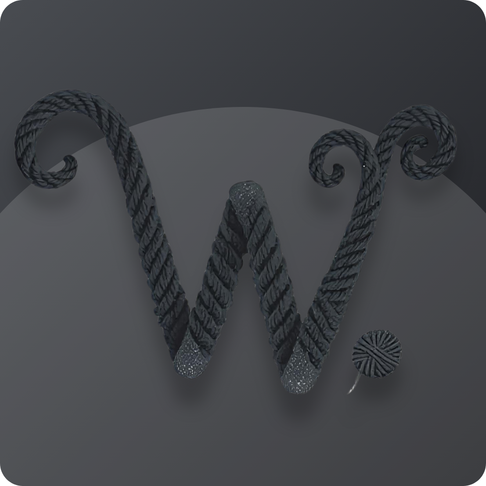

<div align="center">
  
  <h1>Wednesday TTS</h1>
  <p>Text normalization and speech synthesis for Claude Code.<br>
  Raw markdown in → natural spoken audio out.</p>
</div>

---

## Quickstart

```bash
git clone https://github.com/tamm/wednesday-tts
cd wednesday-tts
bash quickstart.sh
```

The script detects Python, creates a venv, installs Pocket TTS with the bundled DWP Aussie
male voice, writes `~/.claude/tts-config.json`, and offers to wire up the Claude Code hooks
and auto-start.

**Requires a HuggingFace login** to download the Pocket TTS model weights:

```bash
hf auth login
```

Requires Python 3.10+. Works on macOS, Linux, and Windows (Git Bash / MSYS2).

---

## How it works

```
Claude response
  → thin hook         integrations/claude-code/speak-response.py
  → POST /speak       localhost:5678
  → normalize         src/wednesday_tts/normalize/pipeline.py
  → synthesize        src/wednesday_tts/server/backends/
  → audio plays
```

---

## Backends

| Backend | Quality | Speed | GPU | Install extra | Notes |
|---------|---------|-------|-----|---------------|-------|
| **Pocket** | Neural, voice-cloned | Fast, streaming | No | `.[pocket]` | Default. DWP Aussie voice bundled |
| **Kokoro** | Neural, built-in voices | Fast | No | `.[kokoro]` | Good quality, many voices |
| **SAM** | Retro 8-bit formant | Instant | No | `.[sam]` | 1982 Commodore 64 synth. Pure Python, zero deps. Gloriously robotic |
| **Soprano** | Neural transformer | Slow | Yes | manual | High quality, needs CUDA |
| **Chatterbox** | Neural, voice-cloned | Slow | Yes | manual | Voice cloning, needs CUDA |

---

## Voice switching

You can switch voices mid-sentence using `{voice:X}...{/voice}` tags in any text sent to the daemon:

```
Normal speech here. {voice:sam}I am now a robot from 1982.{/voice} And back to normal.
```

The daemon renders each segment with its respective backend, resamples to a common sample rate, and stitches the audio together seamlessly. Override backends are lazy-loaded on first use and cached.

From the Python client API:

```python
from wednesday_tts.client.api import speak, voice_tag

# Whole message in SAM
speak("Exterminate", voice="sam")

# Build mixed text manually
text = f"Hello. {voice_tag('I am a robot', 'sam')} Goodbye."
speak(text)
```

In raw daemon protocol (hooks):

```
SEQ:0:1.0:__ct:markdown__Normal text. {voice:sam}Robot text.{/voice} More normal.
```

---

## Manual setup

<details>
<summary>If you prefer to set up by hand</summary>

**Venv + install**

```bash
# Pocket TTS — default, uses bundled DWP voice
uv venv --python 3.12
uv pip install -e ".[pocket]"

# Kokoro — built-in named voices, no voice file needed
uv pip install -e ".[kokoro]"

# SAM — retro robot voice, pure Python, no model files
uv pip install -e ".[sam]"

# Multiple backends + dev tools
uv pip install -e ".[pocket,sam,dev]"
```

**Config**

```bash
cp config/tts-config-template.json ~/.claude/tts-config.json
```

| Key              | Value                                                                 |
| ---------------- | --------------------------------------------------------------------- |
| `active_model`   | `pocket` (default), `kokoro`, or `sam`                                |
| `voice` (pocket) | Path to a `.safetensors` file — bundled DWP voice is at `voices/dwp/` |
| `voice` (kokoro) | Built-in name e.g. `af_bella`                                         |
| `speed` (sam)    | 1–255 (default 72). Higher = slower. Also: `pitch`, `mouth`, `throat` |

**Run the server**

```bash
.venv/bin/python -m wednesday_tts.server.app    # macOS / Linux
.venv/Scripts/python -m wednesday_tts.server.app  # Windows
```

Server listens on `localhost:5678`.

**Auto-start**

- Windows: elevated PowerShell → `scripts/install-tts-service.ps1`
- macOS: `bash quickstart.sh` handles launchd, or see `config/com.anthropic.wednesday-tts.plist`

**Claude Code hooks**

```bash
bash integrations/claude-code/install.sh
```

Then add to `~/.claude/settings.json`:

```json
{
  "hooks": {
    "Stop": [{ "command": "python ~/.claude/hooks/speak-response.py" }],
    "PreToolUse": [{ "command": "python ~/.claude/hooks/pre-tool-speak.py" }]
  }
}
```

See [`integrations/claude-code/README.md`](integrations/claude-code/README.md) for full details.

</details>

---

## Voice setup

The DWP Aussie male voice is bundled at `voices/dwp/`. The quickstart uses it automatically.

To use a different voice, point `voice` in `~/.claude/tts-config.json` at any `.safetensors` file.

---

## Testing

```bash
.venv/Scripts/python -m pytest   # Windows
.venv/bin/python -m pytest       # macOS / Linux
```

---

## Project layout

```
src/wednesday_tts/
  normalize/      17 normalization modules + pipeline
  server/         Flask HTTP server + backends (pocket, kokoro, sam, soprano, chatterbox)
  client/         Thin HTTP client library
  platform.py     Cross-platform helpers
integrations/
  claude-code/    Hooks + install script
data/             tts-dictionary.json, tts-filenames.json
config/           Config template + macOS plist
scripts/          Start/stop/install scripts
docs/normalization/  Rule library (15 rule docs)
tests/            489 tests
```

---

## Credits

[Kyutai Labs](https://github.com/kyutai-labs) — creators of
[Pocket TTS](https://github.com/kyutai-labs/pocket-tts), the default backend.
Brilliant lightweight TTS that runs on CPU with voice cloning support.
Several streaming and chunking patterns in this project are drawn from their work.

Rope logo by Tamm, generated with AI assistance.
